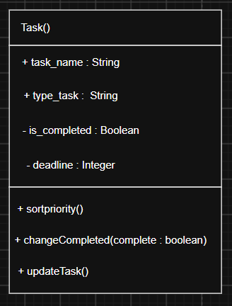
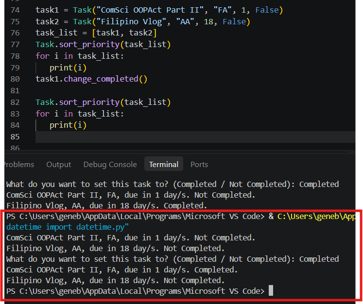

# Class Attributes and Methods
## Previous Design
Link to my previous activity:
[classObjectUML.md](classObjectUML.md)

## Design Revision
Changed Task Name to task_name, completed to is_completed, Type of Task to task_type, Deadline to deadline.

## Visibility Decisions
| Attribute | Data Type | Visibility | Reason |
|---|---|---|---|
|task_name|String|Public|So that it is easily accessible when coding.|
|is_completed|Boolean|Private|To protect it from flipping the true or false value from other variables.|
|task_type|String|Public|So that it is easily accessible when coding.|
|deadline|Integer|Private|To protect it from getting negative values or from having other values influence it.|

## Updated UML Class Diagram

## Python Implementation
[View Python Source](classImplementation.py)

## Test Run

## Object Diagram

## Analysis
### Why did you make your chosen attribute private?
I made the is_completed and deadline private so that it would be easier to debug if an error occurs within those two datapoints. If the two values were public, it would be more likely that the deadline might go negative and cause an error or that the boolean would flip, etc. In addition, its better for the public datapoints like the name of the task and the task type to be public rather than the deadline and is_completed because issues with the output string is easier to debug and also because its better to have the name and type public so that it is easily accessible.

### Which method changes the state of your object?
The method update_task allows the user to change the specific attributes of an object task through their input. Unfortunately, the update_task does not ask which task to update through user input but rather through changing the code itself. The method changes the object by first asking which attribute to change, and then the new name or type that is inputted by the user is then declared into a separate variable and then that variable is then declared into the specific attribute of the task.

### How did your two objects demonstrate that instances are independent?
The two objects demonstrated that instances are independent because it demonstrates how affecting one attribute of an object does not affect the other object's same attribute. In the test run, changing the Not Completed of task one through change_completed only affected task one and not task two. This suggests that instances are independent since only one of them changed and not both of them through the use of the self prefix an private characteristic.

### What is the difference between your class diagram and your object diagram?
The class diagram serves as the blueprint of the objects that are instantiated out of the parent class. In the task class, the class has 4 attributes, task_name, task_type, deadline and is_completed. The first object is named "ComSci OOPAct Part II" and its type is FA, deadline is due in 1 day, and Not Completed. The second object is "Filipino Vlog" and its type is AA, deadline is due in 18 days, and Not Completed. As you can notice, the objects take the form of the class Task, and have its properties.
