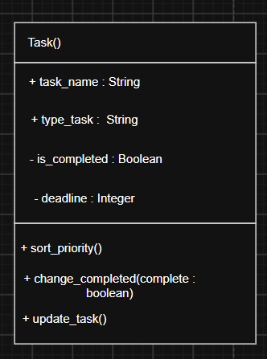
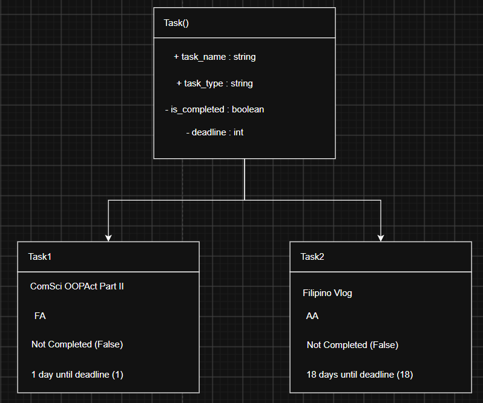

# Class Attributes and Methods
## Previous Design
Link to my previous activity:
[classObjectUML.md](classObjectUML.md)

## Design Revision
Changed Task Name to task_name, completed to is_completed, Type of Task to task_type, Deadline to deadline.
Changed data type of deadline to string to fit dd/mm/yy format.

## Visibility Decisions
| Attribute | Data Type | Visibility | Reason |
|---|---|---|---|
| | | | |
| | | | |
| | | | |
| | | | |
## Updated UML Class Diagram

## Python Implementation

[View Python Source](classImplementation.py)
## Test Run

## Object Diagram

## Analysis
### Why did you make your chosen attribute private?
### Which method changes the state of your object?
### How did your two objects demonstrate that instances are independent?
### What is the difference between your class diagram and your object diagram?

## Class Name
Task
## Class Description
This class is used in the context of an online task / homework manager. This class contains data fields such as the name of a task, it's deadline, whether or not the task has been completed, and also what the type of task it is.
## Properties
| Property | Data Type | Description |
|---|---|---|
| Task Name | String | This property of the object is the name of the task set by the user.|
| Deadline | Integer | This integer property of the object is the deadline of that specific task. |
| Completed | Boolean | This property tells whether or not the task is done or not. This property is set to false automatically. |
| Type of Task | String | This property is set by the user and tells the type of task it is (AA, FA, Group Project, etc.) |
## Methods
| Method | Description |
|---|---|
| sortpriority() | Makes all tasks return a value of Deadline - datetoday, and outputs all tasks in order of what task's deadline is closest to today's date.|
| changeCompleted(complete : boolean) | Allows the user to change the "Completed" property of the task. |
| updateTask() | Allows the user to update the task's name, deadline, or type of task.|
